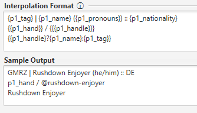
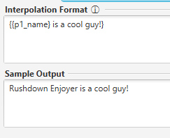
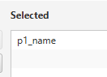
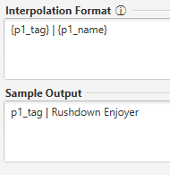
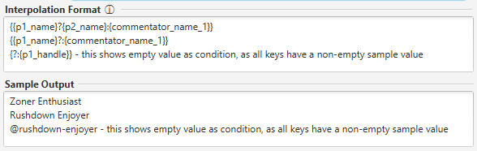

# Custom Interpolation Formatting
The custom interpolation format allows the user to define their own set of player- or match-properties to compose into the desired output file. \


The format allows two types of syntax tokens: plain text and an eval(-uated) expression.
An eval-expression looks like so: 
```
{some text}
```
It is simply some text embedded in squiggly brackets.
The magic lies in the way the expression content is evaluated. Allowed elements include:
- Embedded expressions. If there is an embedded expression, it is resolved before carrying on with the current expression.
  This means multi-nesting is possible and the deepest expressions are evaulated first. \
  
- Plain text. If no other rule evaluates sucessfully, the expression content is treated as plaintext and replaced as-is, without the squiggly brackets. \
  
- Input key replacement. If the expression content matches the name of any input key that's present within the Unit's input configuration, the expression is replaced with the value of that key. \
  This value-replacement is particularly handy for use as the ternary operation condition-value, as described in the next point.
  If this key is not present within input config, the rule is not applied and evaluates as plaintext. \
   
- Ternary expression. This is based on the concept of a [ternary operator](https://en.wikipedia.org/wiki/Ternary_conditional_operator) as often seen in programming languages. \
  This rule requires two tokens are detected within the expression: the if-then token "?" and the else token ":".
  - Everything between the expression start token "{" and the "?" is then treated as the condition value.
  - Everything between the if-then token "?" and the else token ":" is treated as the positive-outcome value.
  - Everything between the else token ":" and the expression end token "}" is treated as the negative-outcome value.
  After the expression is fully parsed it is then evaluated like a simple if-else statement — the 
  positive-outcome value is used if the condition value is not empty and the negative-outcome value is used otherwise.\
  There is one extra utility involved — if the positive-outcome value is empty, it is meant that the condition value should be used in its stead.
  This allows the shortform "condition?:else" notation. \
  **An important distinction to make is that an empty value is not the same as a blank value.** A blank value is any nonzero-width piece of text including any blank characters, like whitespace.
  Hence, if you wish to replace with an empty string while using the shortform — it is currently recommended to use a whitespace character. \
  

A couple notes about this system:
1. A currently planned feature includes shortform input-key matching in the form of a "$" followed by a numeric value indicating the index of the desired key. This would take place before ANY other evaluation.
2. This system can be used best when custom output file names are allowed. That would allow the creation of any given display file desired. As that feature is in plans for the V0.3 release, please stay tuned.
   - Optionally, custom player properties could also help enhance this feature...
  